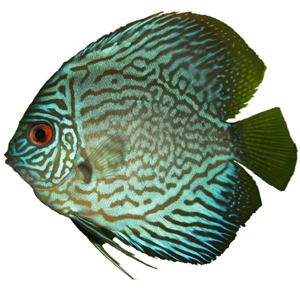

Discus
======

The Discus language is an experimental dialect of Haskell which investigates static typing and program transformation in the presence of computational effects. :ref:`Version 0.5.1 <release-notes-0.5.1>` is "working alpha" quality, meaning there is a complete system that can be hacked around with, but it's not yet industrial strength.

The main language features are:

* Haskell-like source language, so Haskell-like programs should work with minor modifications.
* Modal region and effect system using 'box' and 'run' to suspend and force computations.
* Higher rank polymorphism with bidirectional type inference.
* Simple two space copying garbage collection.
* Default call-by-value evaluation.
* Typed external core language.

Examples
========

For example programs, see the demo_ directory on github, which includes:

* `Conway's Life`_ demo which uses mutable arrays.
* `Almost Primes`_ demo which uses infinite streams.
* `Lambda`_        demo which defines a simple lambda calculus interpreter.
* `Ray Tracer`_    demo which makes nice pictures, described in this `blog post`_.

.. _demo:               https://github.com/DDCSF/ddc/tree/master/test/ddc-demo/source/Discus
.. _`Conway's Life`:    https://github.com/DDCSF/ddc/tree/master/test/ddc-demo/source/Discus/10-Defib/04-Life
.. _`Almost Primes`:    https://github.com/DDCSF/ddc/blob/master/test/ddc-demo/source/Discus/80-Rosetta/AlmostPrime/Main.ds
.. _`Lambda`:           https://github.com/DDCSF/ddc/tree/master/test/ddc-demo/source/Discus/90-Language/01-Lambda
.. _`Ray Tracer`:       https://github.com/DDCSF/ddc/tree/master/test/ddc-demo/source/Discus/40-Graphics/10-RayTrace
.. _`blog post`:        http://blog.discus-lang.org/2017/07/ray-tracer-demo.html

Documentation
=============

.. toctree::
   :maxdepth: 1

   section/01-GettingStarted.rst
   section/02-Specification.rst
   section/03-Release.rst

More Information
================

:Home Page:     http://discus-lang.org
:Dev Blog:      http://blog.discus-lang.org
:Bug Tracker:   http://trac.discus-lang.org
:GitHub Page:   https://github.com/discus-lang
:Dev Buildbot:  https://travis-ci.org/discus-lang
:IRC Channel:   Channel #discus-lang on http://freenode.net
:Mailing List:  http://groups.google.com/group/discus-lang
:Commit Log:    http://groups.google.com/group/discus-log

